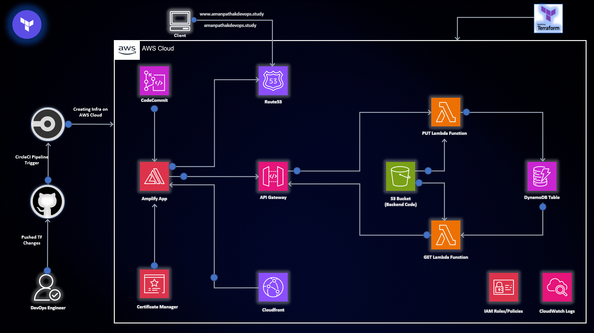

# Cloud-Serverless-Project - Full Stack AWS Serverless Project 🚀

Welcome to Awesome App - a full-stack AWS Serverless project showcasing the power of serverless architecture to deploy frontend and backend components seamlessly.

## Table of Contents

- [Overview](#overview)
- [Features](#features)
- [Folder Structure](#folder-structure)
- [Getting Started](#getting-started)
- [Frontend](#frontend)
- [Backend](#backend)
- [Deployment](#deployment)
- [Contributing](#contributing)
- [License](#license)

## Overview

Awesome App is a modern, scalable, and serverless application that demonstrates the integration of frontend and backend components on AWS Serverless Services. Leverage the power of AWS Amplify, Lambda, DynamoDB, and API Gateway for a hassle-free deployment experience.

## Features

- **Serverless Deployment:** Utilize AWS Serverless Services for a scalable and cost-effective deployment.
- **Full Stack:** Frontend (HTML, CSS, JS) and Backend (Python) seamlessly integrated.
- **Database:** No SQL Database (DynamoDB) for efficient data storage.

## Folder Structure

Welcome to Project Name! A [brief description] of your project. Share its purpose, key features, and why it's awesome.

## Table of Contents 📋

- [Introduction](#introduction)
- [Features](#features)
- [Prerequisites](#prerequisites)
- [Getting Started](#getting-started)
  - [Frontend](#frontend)
  - [Backend](#backend)
- [Deployment](#deployment)
- [Contributing](#contributing)
- [License](#license)
- [Acknowledgments](#acknowledgments)

## Introduction 🌟

Introduce your project in a way that excites readers. What makes it unique and valuable?

## Features ✨

Highlight the key features that set your project apart. Use emojis and concise language.

- 🎨 Beautiful and responsive UI
- 💡 Intelligent feature X
- 🚀 Lightning-fast performance

## Prerequisites 🛠️

List any dependencies or tools users need to have before diving into your project.

## Getting Started

To get started with Awesome App, follow these simple steps:

1. Clone the repository: `git clone https://github.com/AmanPathak-DevOps/Cloud-Serverless-Project.git`
2. Navigate to the `frontend` folder and explore the frontend code.
3. Check out the `backend` folder for the awesome backend logic.
4. Customize and adapt the code based on your project requirements.
5. Deploy the application using the provided deployment guides.

## Frontend

The `Frontend` folder contains the HTML, CSS, and JS files responsible for the user interface and client-side functionalities. Customize these files to match your application's design.

## Backend

The `Backend` folder houses the backend logic written in Python. This includes Lambda functions that handle server-side processing and interactions with AWS services. Modify these files to tailor the backend to your specific needs.

## Deployment

If you want to deploy this project using AWS Serverless Services, refer to the following:

- **Manual Deployment:** Explore the detailed [blog post](#) for step-by-step instructions on manually setting up the project.

- **Terraform Deployment:** For an automated infrastructure-as-code approach, check out the [Terraform repository](https://github.com/AmanPathak-DevOps/Terraform-for-AWS/blob/master/Non-Modularized/AWS-Serverless-Project/) and follow the provided instructions.

## Contributing

Contributions are welcome! If you have ideas for improvements, find bugs, or want to add new features, feel free to submit a pull request.

## License

This project is licensed under the [MIT License](LICENSE).